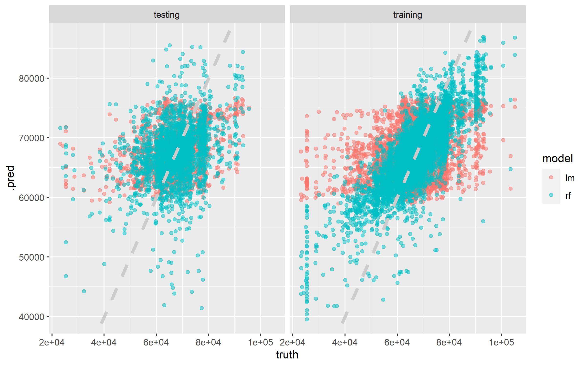

NFL Attendance - Feb 05, 2020
================
2022-10-11

Here the goal is to build a model to predict weekly attendance for teams
in NFL games.

## Explore Data

``` r
attendance <- read_csv("https://raw.githubusercontent.com/rfordatascience/tidytuesday/master/data/2020/2020-02-04/attendance.csv")
standings <- read_csv("https://raw.githubusercontent.com/rfordatascience/tidytuesday/master/data/2020/2020-02-04/standings.csv")

attendance_joined <- attendance %>%
  left_join(standings,
    by = c("year", "team_name", "team")
  )

attendance_joined
```

    ## # A tibble: 10,846 × 20
    ##    team    team_n…¹  year  total   home   away  week weekl…²  wins  loss point…³
    ##    <chr>   <chr>    <dbl>  <dbl>  <dbl>  <dbl> <dbl>   <dbl> <dbl> <dbl>   <dbl>
    ##  1 Arizona Cardina…  2000 893926 387475 506451     1   77434     3    13     210
    ##  2 Arizona Cardina…  2000 893926 387475 506451     2   66009     3    13     210
    ##  3 Arizona Cardina…  2000 893926 387475 506451     3      NA     3    13     210
    ##  4 Arizona Cardina…  2000 893926 387475 506451     4   71801     3    13     210
    ##  5 Arizona Cardina…  2000 893926 387475 506451     5   66985     3    13     210
    ##  6 Arizona Cardina…  2000 893926 387475 506451     6   44296     3    13     210
    ##  7 Arizona Cardina…  2000 893926 387475 506451     7   38293     3    13     210
    ##  8 Arizona Cardina…  2000 893926 387475 506451     8   62981     3    13     210
    ##  9 Arizona Cardina…  2000 893926 387475 506451     9   35286     3    13     210
    ## 10 Arizona Cardina…  2000 893926 387475 506451    10   52244     3    13     210
    ## # … with 10,836 more rows, 9 more variables: points_against <dbl>,
    ## #   points_differential <dbl>, margin_of_victory <dbl>,
    ## #   strength_of_schedule <dbl>, simple_rating <dbl>, offensive_ranking <dbl>,
    ## #   defensive_ranking <dbl>, playoffs <chr>, sb_winner <chr>, and abbreviated
    ## #   variable names ¹​team_name, ²​weekly_attendance, ³​points_for

``` r
attendance_joined %>%
  filter(!is.na(weekly_attendance)) %>%
  ggplot(aes(fct_reorder(team_name, weekly_attendance),
    weekly_attendance,
    fill = playoffs
  )) +
  geom_boxplot(outlier.alpha = 0.5) +
  coord_flip()
```

<!-- -->

``` r
attendance_joined %>%
  distinct(team_name, year, margin_of_victory, playoffs)
```

    ## # A tibble: 638 × 4
    ##    team_name  year margin_of_victory playoffs   
    ##    <chr>     <dbl>             <dbl> <chr>      
    ##  1 Cardinals  2000             -14.6 No Playoffs
    ##  2 Falcons    2000             -10.1 No Playoffs
    ##  3 Ravens     2000              10.5 Playoffs   
    ##  4 Bills      2000              -2.2 No Playoffs
    ##  5 Panthers   2000               0   No Playoffs
    ##  6 Bears      2000              -8.7 No Playoffs
    ##  7 Bengals    2000             -10.9 No Playoffs
    ##  8 Browns     2000             -16.1 No Playoffs
    ##  9 Cowboys    2000              -4.2 No Playoffs
    ## 10 Broncos    2000               7.3 Playoffs   
    ## # … with 628 more rows

``` r
attendance_joined %>%
  distinct(team_name, year, margin_of_victory, playoffs) %>%
  ggplot(aes(margin_of_victory, fill = playoffs)) +
  geom_histogram(postition = "identity", alpha = 0.7)
```

<!-- -->

``` r
attendance_joined %>%
  mutate(week = factor(week)) %>%
  ggplot(aes(week, weekly_attendance, fill = week)) +
  geom_boxplot(show.legend = FALSE, outlier.alpha = 0.5)
```

<!-- -->

``` r
attendance_df <- attendance_joined %>%
  filter(!is.na(weekly_attendance)) %>%
  select(
    weekly_attendance, team_name, week,
    margin_of_victory, strength_of_schedule, playoffs
  )

attendance_df
```

    ## # A tibble: 10,208 × 6
    ##    weekly_attendance team_name  week margin_of_victory strength_of_sch…¹ playo…²
    ##                <dbl> <chr>     <dbl>             <dbl>             <dbl> <chr>  
    ##  1             77434 Cardinals     1             -14.6              -0.7 No Pla…
    ##  2             66009 Cardinals     2             -14.6              -0.7 No Pla…
    ##  3             71801 Cardinals     4             -14.6              -0.7 No Pla…
    ##  4             66985 Cardinals     5             -14.6              -0.7 No Pla…
    ##  5             44296 Cardinals     6             -14.6              -0.7 No Pla…
    ##  6             38293 Cardinals     7             -14.6              -0.7 No Pla…
    ##  7             62981 Cardinals     8             -14.6              -0.7 No Pla…
    ##  8             35286 Cardinals     9             -14.6              -0.7 No Pla…
    ##  9             52244 Cardinals    10             -14.6              -0.7 No Pla…
    ## 10             64223 Cardinals    11             -14.6              -0.7 No Pla…
    ## # … with 10,198 more rows, and abbreviated variable names
    ## #   ¹​strength_of_schedule, ²​playoffs

## Train model

``` r
library(tidymodels)

set.seed(1234)
attendance_split <- attendance_df %>%
  initial_split(strata = playoffs)

nfl_train <- training(attendance_split)
nfl_test <- testing(attendance_split)
```

``` r
# specifying a model

lm_spec <- linear_reg() %>%
  set_engine("lm")

lm_spec
```

    ## Linear Regression Model Specification (regression)
    ## 
    ## Computational engine: lm

``` r
# fitting a model
lm_fit <- lm_spec %>%
  fit(weekly_attendance ~ ., data = nfl_train)

lm_fit %>%
  tidy() %>%
  arrange(-estimate)
```

    ## # A tibble: 36 × 5
    ##    term              estimate std.error statistic  p.value
    ##    <chr>                <dbl>     <dbl>     <dbl>    <dbl>
    ##  1 (Intercept)         68915.      572.    121.   0       
    ##  2 team_nameCowboys     7146.      763.      9.37 9.25e-21
    ##  3 team_nameGiants      6296.      757.      8.31 1.08e-16
    ##  4 team_nameRedskins    5902.      757.      7.79 7.39e-15
    ##  5 team_nameJets        4609.      759.      6.08 1.29e- 9
    ##  6 team_nameBroncos     2947.      764.      3.86 1.15e- 4
    ##  7 team_nameChiefs      2152.      751.      2.86 4.18e- 3
    ##  8 team_namePanthers    2040.      756.      2.70 6.94e- 3
    ##  9 team_nameEagles      1644.      766.      2.15 3.19e- 2
    ## 10 team_namePackers     1459.      764.      1.91 5.61e- 2
    ## # … with 26 more rows

``` r
# specifying a random forest model
rf_spec <- rand_forest(mode = "regression") %>%
  set_engine("ranger")

rf_spec
```

    ## Random Forest Model Specification (regression)
    ## 
    ## Computational engine: ranger

``` r
# fitting a model
rf_fit <- rf_spec %>%
  fit(weekly_attendance ~ ., data = nfl_train)

rf_fit
```

    ## parsnip model object
    ## 
    ## Ranger result
    ## 
    ## Call:
    ##  ranger::ranger(x = maybe_data_frame(x), y = y, num.threads = 1,      verbose = FALSE, seed = sample.int(10^5, 1)) 
    ## 
    ## Type:                             Regression 
    ## Number of trees:                  500 
    ## Sample size:                      7656 
    ## Number of independent variables:  5 
    ## Mtry:                             2 
    ## Target node size:                 5 
    ## Variable importance mode:         none 
    ## Splitrule:                        variance 
    ## OOB prediction error (MSE):       74375320 
    ## R squared (OOB):                  0.1013933

## Evaluate model

``` r
results_train <- lm_fit %>%
  predict(new_data = nfl_train) %>%
  mutate(
    truth = nfl_train$weekly_attendance,
    model = "lm"
  ) %>%
  bind_rows(
    rf_fit %>%
      predict(new_data = nfl_train) %>%
      mutate(
        truth = nfl_train$weekly_attendance,
        model = "rf"
      )
  )

results_test <- lm_fit %>%
  predict(new_data = nfl_test) %>%
  mutate(
    truth = nfl_test$weekly_attendance,
    model = "lm"
  ) %>%
  bind_rows(
    rf_fit %>%
      predict(new_data = nfl_test) %>%
      mutate(
        truth = nfl_test$weekly_attendance,
        model = "rf"
      )
  )
```

``` r
results_train %>%
  group_by(model) %>%
  yardstick::rmse(truth = truth, estimate = .pred)
```

    ## # A tibble: 2 × 4
    ##   model .metric .estimator .estimate
    ##   <chr> <chr>   <chr>          <dbl>
    ## 1 lm    rmse    standard       8375.
    ## 2 rf    rmse    standard       5867.

``` r
results_test %>%
  group_by(model) %>%
  yardstick::rmse(truth = truth, estimate = .pred)
```

    ## # A tibble: 2 × 4
    ##   model .metric .estimator .estimate
    ##   <chr> <chr>   <chr>          <dbl>
    ## 1 lm    rmse    standard       8190.
    ## 2 rf    rmse    standard       8675.

``` r
results_test %>%
  mutate(train = "testing") %>%
  bind_rows(results_train %>%
    mutate(train = "training")) %>%
  ggplot(aes(truth, .pred, color = model)) +
  geom_point(alpha = 0.5) +
  geom_abline(lty = 2, color = "gray80", size = 1.5) +
  facet_wrap(~train)
```

<!-- -->

## Lets try again with resampling

``` r
set.seed(1234)

nfl_folds <- vfold_cv(nfl_train, strata = playoffs)

nfl_folds
```

    ## #  10-fold cross-validation using stratification 
    ## # A tibble: 10 × 2
    ##    splits             id    
    ##    <list>             <chr> 
    ##  1 <split [6890/766]> Fold01
    ##  2 <split [6890/766]> Fold02
    ##  3 <split [6890/766]> Fold03
    ##  4 <split [6890/766]> Fold04
    ##  5 <split [6890/766]> Fold05
    ##  6 <split [6890/766]> Fold06
    ##  7 <split [6891/765]> Fold07
    ##  8 <split [6891/765]> Fold08
    ##  9 <split [6891/765]> Fold09
    ## 10 <split [6891/765]> Fold10

``` r
rf_res <- fit_resamples(
  rf_spec,
  weekly_attendance ~ .,
  nfl_folds,
  control = control_resamples(save_pred = TRUE)
)

rf_res %>%
  collect_metrics()
```

    ## # A tibble: 2 × 6
    ##   .metric .estimator     mean     n std_err .config             
    ##   <chr>   <chr>         <dbl> <int>   <dbl> <chr>               
    ## 1 rmse    standard   8653.       10 84.0    Preprocessor1_Model1
    ## 2 rsq     standard      0.123    10  0.0150 Preprocessor1_Model1

``` r
rf_res %>%
  unnest(.predictions) %>%
  ggplot(aes(weekly_attendance, .pred, color = id)) +
  geom_abline(lty = 2, color = "gray80", size = 1.5) +
  geom_point(alpha = 0.5)
```

<!-- -->
